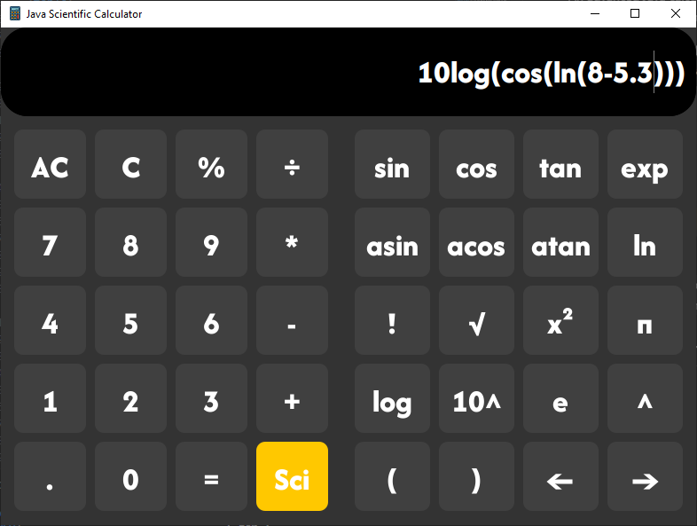

# Java Scientific Calculator ⚛️

An advanced Java calculator featuring a sleek GUI, scientific functions, and robust error handling.

<table>
  <tr>
    <td align="center">
      
      <br>
      <em>Basic operations</em>
    </td>
    <td align="center">
      
      <br>
      <em>Scientific functions</em>
    </td>
  </tr>
</table>

## Table of Contents
## Table of Contents
- [Features](#features-✨)
- [Prerequisites](#prerequisites-📋)
- [Installation](#installation-🛠️)
- [Usage](#usage-🚀)
- [Examples](#examples-📊)
- [Contributing](#contributing-🤝)
- [License](#license-📜)


## Features ✨
- **Basic Arithmetic**: `+`, `-`, `×`, `÷`, `%`
- **Scientific Operations**: trigonometrics, exponentials, logarithms, factorials, etc.
- **Implicit Multiplication**: Support for expressions like `9sin(90)`, interpreted as `9 * sin(90)`.
- **Results memorization**: Stores previous calculated expressions (try UP/DOWN arrows).
- **Error Handling**: Displays error messages for invalid expressions or arithmetic exceptions (e.g. division by zero).


## Prerequisites 📋
- **Java 17** or later  
- **Maven 3.6+**

> **Note:** You can check that with `java -version` and `mvn -v`.


## Installation 🛠️

1. **Clone this repository**:
   ```bash
   git clone https://github.com/PhasmeHargneux/calculator.git
   cd calculator
   ```

2. **Build the project**:
   ```bash
   mvn clean install
   ```

## Usage 🚀

### Run via Maven
If you want to run the application directly :

```bash
mvn exec:java 
```

## Examples 📊

### Basic Arithmetic
```bash
2 + 3  => 5
12 - 7 => 5
4 * 6  => 24
```

### Advanced Functions
```bash
sin(90)    => 1
log(100)   => 2
9sin(90)   => 9
```

### Error Handling
```bash
5 / 0 => Error: Cannot divide by zero
8++2 => Error: Invalid input
```

## Contributing 🤝
1. Fork the repository.
2. Create a new branch (feature/your-feature).
3. Commit your changes with a meaningful message.
4. Open a Pull Request to discuss and merge your changes.

## License 📜
This project is licensed under the MIT License. See the LICENSE file for details.
